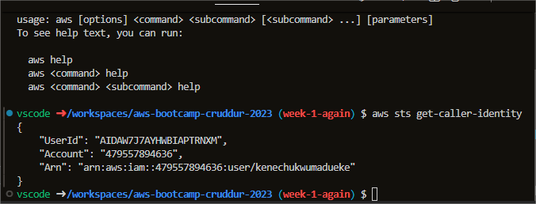
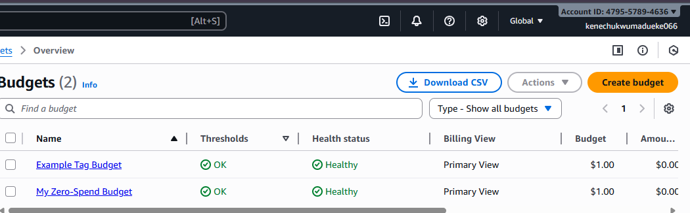
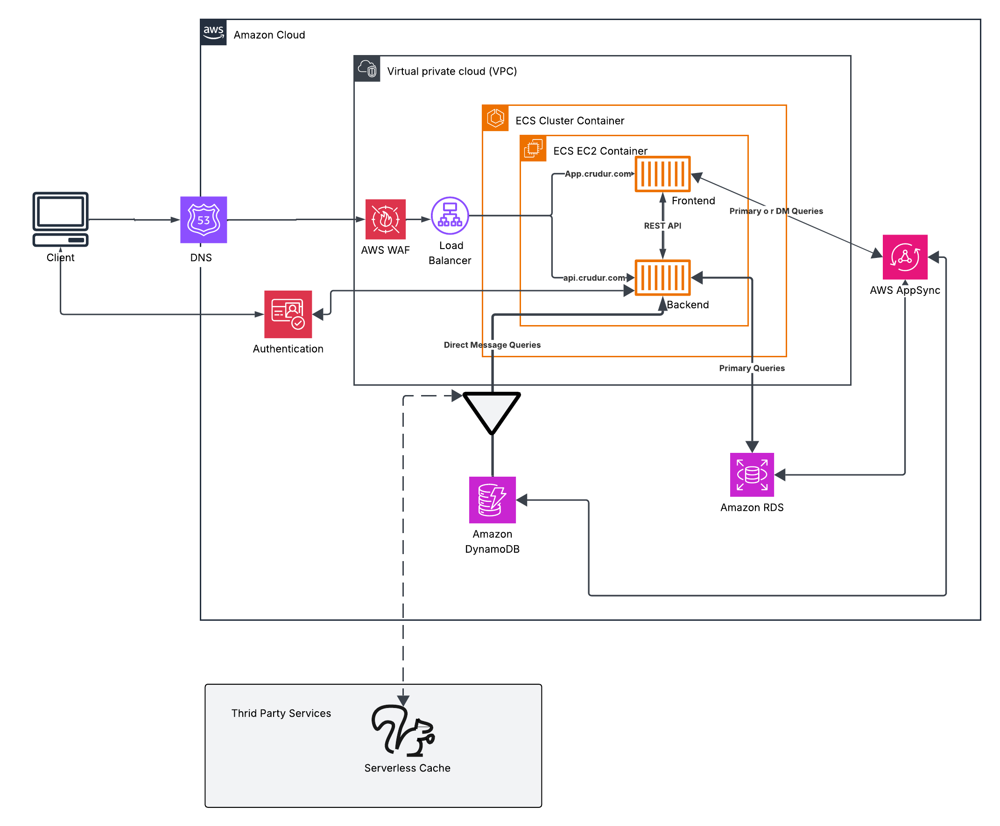

# Week 0 — Billing and Architecture

## Required Homeworks/Tasks

### Install AWS CLI FOR ONA LINUX

I was able to use ONA (formally known as gitpod) to install using the terminal and use AWS CLI.

I did  the following steps to install AWS CLI.

I installed theAWS CLI via command in **ONA CODE TERMINAL**:
I followed the Intructions on the [AWS CLI Install Documentation Page](https://docs.aws.amazon.com/cli/latest/userguide/getting-started-install.html)




```
curl "https://awscli.amazonaws.com/awscli-exe-linux-x86_64.zip" -o "awscliv2.zip"
unzip awscliv2.zip
sudo ./aws/install
```


###Install anf Verify AWS CLI FOR WINDOWS 10 OR 11

Providing Instructions I used for my configuration on my local machine on windows.
I did the following instructions to install my AWS CLI

I Installed the following AWS CLI for windows command in **Command Prompt**:

I followed the instructions on the [AWS CLI Install Documentaton Page](https://docs.aws.amazon.com/cli/latest/userguide/getting-started-install.html) 

```
msiexec.exe /i https://awscli.amazonaws.com/AWSCLIV2.msi
```
After the Installion, I closed my command prompt and opened it again and it worked Prove with screenshoot below 


###Creating a Budget
I created my own Budget for $1 per dollar for each Budgets because I cannot afford any kind of spend.
I did not create a third Budget because creating a third budget spendig goes over my free limit and AWS will charge me.



### Recreate Logical Archetecture Design in Lucid Charts



[Lucid Chart Shared Links](https://lucid.app/lucidchart/5564adc0-83b5-4b8f-9361-5c187c1f0f2e/edit?viewport_loc=-558%2C-1030%2C2060%2C1146%2C0_0&invitationId=inv_d0c43cbb-17f3-49a0-aaa3-a1f12f033db1)

## Homework Challenge 
